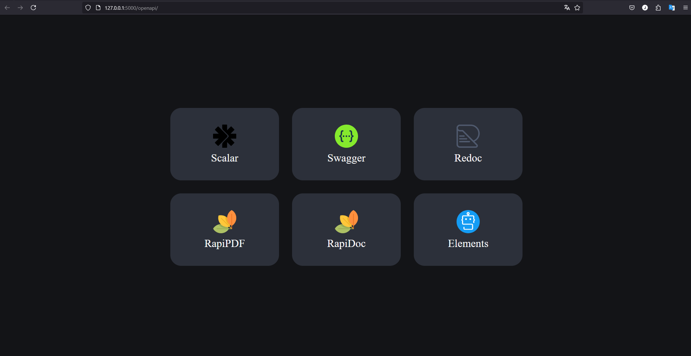
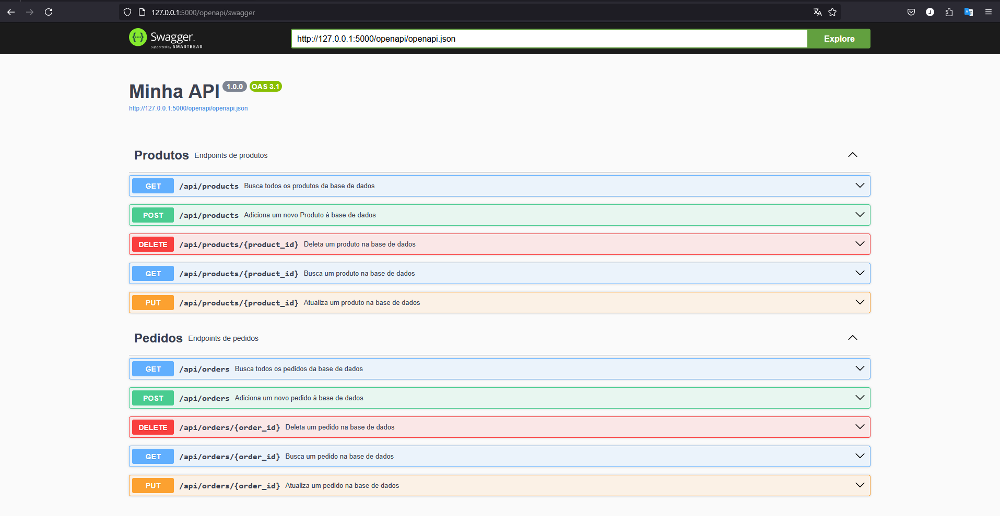

# Kitchen Queue API

Este projeto é uma API do produto mínimo viável (MVP) de um sistema de 
gerenciamento de filas de pedidos voltado para restaurantes.
O objetivo deste sistema é realizar a gestão da fila de pedidos de um restaurante. Os colaboradores
responsáveis pelo atendimento serão responsáveis por inserir as informações dos pedidos,
que serão então encaminhados para a cozinha. A partir desse ponto, a equipe da cozinha poderá acompanhar 
e atualizar o status de cada pedido até que estejam finalizados e disponíveis para retirada pelos garçons.


### 📋 Pré-requisitos

#### Python

Deve-se ter o python instalado na versão Python 3.10+ para criarmos o diretorio venv

#### Venv

O projeto foi desenvolvido em Python utilizando o framework Flask. Para a instalação das dependências, 
recomenda-se a criação de um ambiente virtual com o [venv](https://virtualenv.pypa.io/en/latest/installation.html), garantindo o isolamento adequado do ambiente de desenvolvimento. Siga a documentação do venv [aqui](https://virtualenv.pypa.io/en/latest/installation.html) para configurar e ativar de acordo com o seu sistema operacional.


### 🔧 Instalação

Após a configuração e ativação do virtualenv deve-se instalar as dependencias do projeto que estão listadas no arquivo requirements.txt
utilizando o gerenciador de pacotes [pip](https://pip.pypa.io/en/stable/getting-started/) :

```
pip install -r requirements.txt
```

## ⚙️ Executando o projeto

Para executar o projeto deve-se rodar o preferencialmente o seguinte comando 
executando diretamente o arquivo python, para que o projeto seja startado no 
endereço local http://127.0.0.1:5000 :

```
python app.py
```

Ou com o seguinte comando CLI do flask escolhendo o host e porta :

```
flask run --host=0.0.0.0 --port=5000 
```

Ao final abra a url http://127.0.0.1:5000 no navegador, e iremos ser redirecionados para 
a pagina de seleção da documentação da API:



Ao selecionar swagger teremos essa pagina de documentação, onde poderemos testar os endpoints da API :




## 🛠️ Construído com

Algumas ferramentas para a construção do projeto :

* [Flask](http://www.dropwizard.io/1.0.2/docs/) - O framework web usado
* [pip](https://pip.pypa.io/en/stable/getting-started/) - Gerenciador de Dependências


## ✒️ Autores

* **Desenvolvedor** - [Jean Junior Silva de Sousa](https://github.com/JeanSousa)


---
